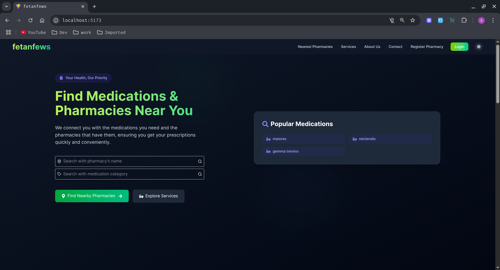
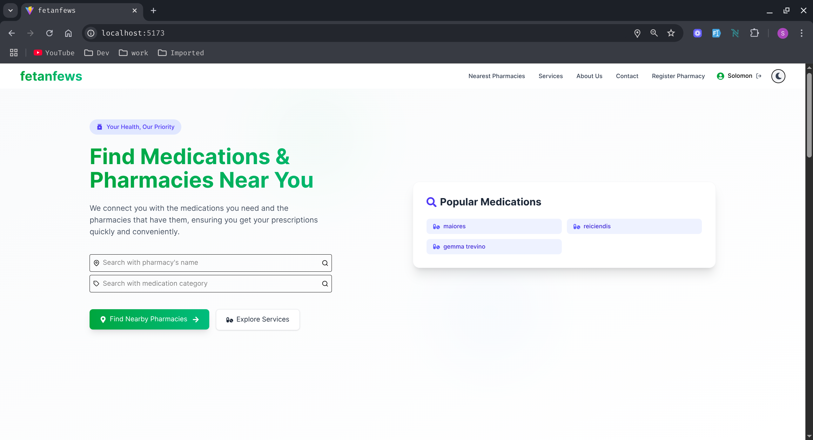
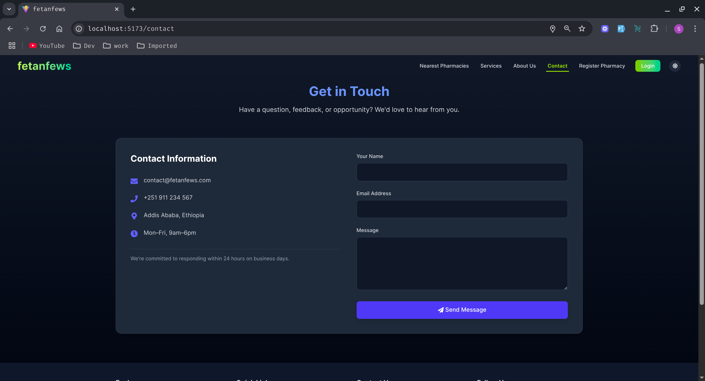
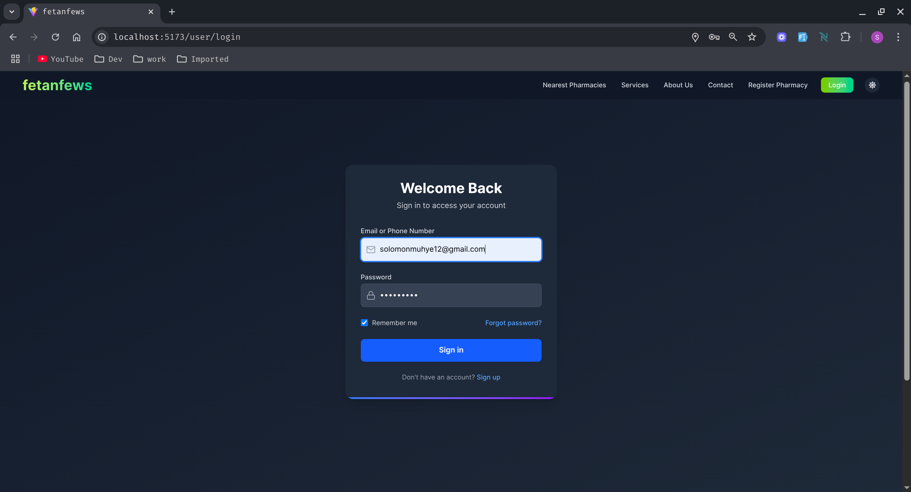
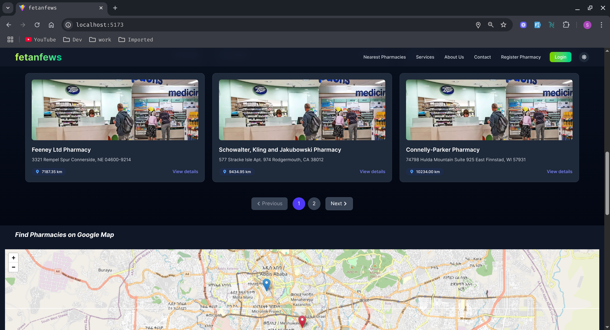
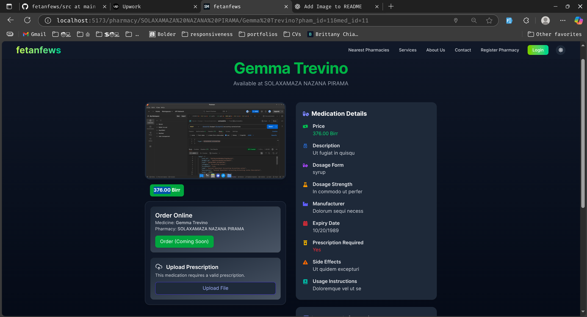
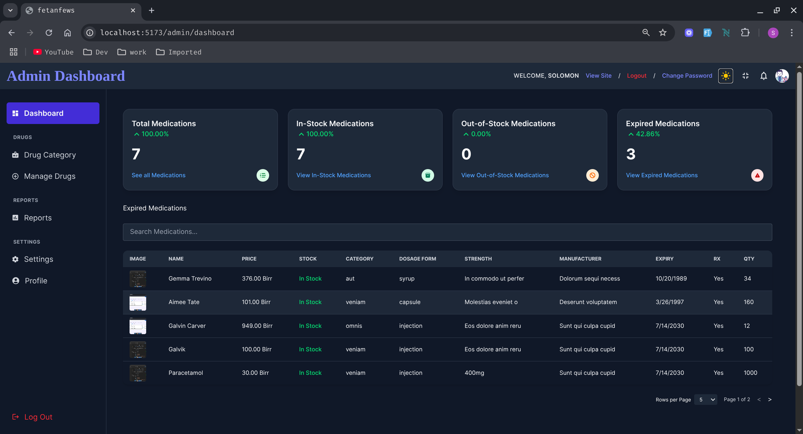
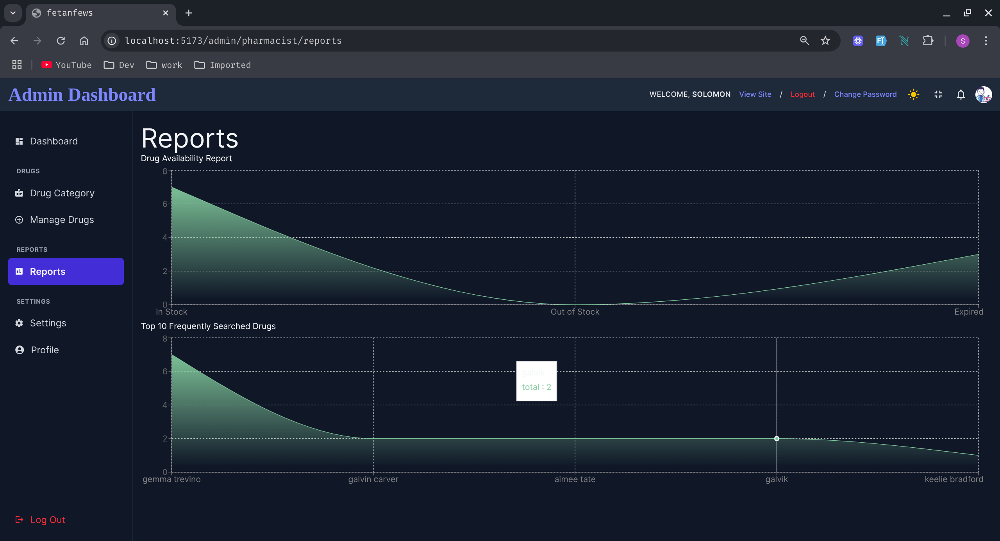

# Fetanfews | Location based pharmacy and medication finder

fetanfews is a location based pharmacy finder that allows user to locate medications and pharmacies around them. it allows user to choose thier nearest, or the cheapest pharmacies around them.

## 🔍 Features

- 🌐 Map-based pharmacy search
- View pharmacy details, location, and contact info
- See available medicines and descriptions
- Admin panel for managing reports and users
- Secure authentication with Firebase
- Responsive UI for both mobile and desktop

---

## 🛠️ Tech Stack

| Layer          | Tech / Library                                |
| -------------- | --------------------------------------------- |
| **Frontend**   | React, TypeScript, TailwindCSS, Framer-motion |
| **Backend**    | PHP, Laravel                                  |
| **Database**   | MySql                                         |
| **Auth**       | Sanctum Authentication                        |
| **Maps**       | Leaflet.js                                    |
| **Deployment** | Vercel (frontend), Render (backend)           |

---

## User Page

  
  
  
  
  
  

## Admin Pages

  
  

🤝 Contributing
Pull requests are welcome! For major changes, please open an issue first to discuss what you'd like to change.
